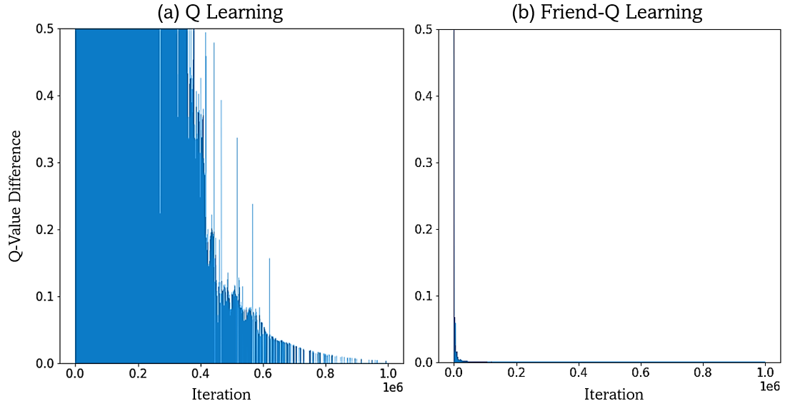
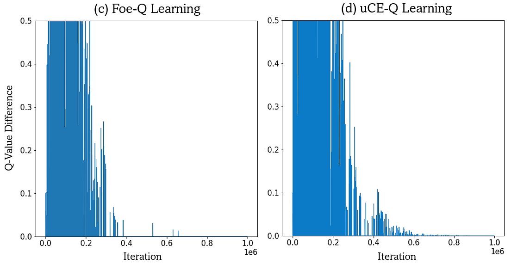

# Correlated-Q Learning

This paper describes and replicates the Soccer environment, a two-player, zero-sum Markov game from Greenwald and Hall. Four variants of Q-Learning algorithms are applied to the Soccer game and convergence to equilibrium policies is validated. This paper also discusses the theoretical foundations of multiagent Q-learning techniques.

## Code Execution

Each Learner (Q, Friend-Q, Foe-Q nd CE-Q), with oponent following the same strategy, has its own ipynb file. The files need to be run individually and there need not be any changes except for the "path" where the csv files will be saved. The code saves Q-values, pi, and ERR in three separate csv files. The plots used in the report are in the ipynb file.

I have also included each learner againt a random agent cases as well. Although such learning is not the best and is not relevant to the project.

## Results

